## RStudio in the Cloud
At the end of this tutorial, we will be able to install RStudio on an Amazon Web Services(AWS) EC2 Instance and use it via any web browser. This tutorial uses Amazon Web Services (AWS), but it could just as easily use Microsot, Google, or any other provider. 

The only prerequisite is an AWS account, which you can [sign up](https://aws.amazon.com/) for if you haven’t already. A credit card is required to sign up, but you will only be charged for computing time you use, and Amazon offers an excellent [free tier](https://aws.amazon.com/free/) that is suitable for small jobs. 

We will be using [Louis Aslett's pre-configured AMI's](http://www.louisaslett.com/RStudio_AMI/) to speed up our configuration and installation of required software.

### Introduction to AWS
Amazon Web Services (AWS) provides on-demand computing resources and services in the cloud, with pay-as-you-go pricing. Using AWS resources instead of your own is like purchasing electricity from a power company instead of running your own generator, and it provides many of the same benefits: capacity exactly matches your need, you pay only for what you use, economies of scale result in lower costs.

### AWS Elastic Compute Cloud (EC2) Service
While AWS is a platform which a plethora of cloud comupting services, this tutorials focus will be on one service called Elastic Compute Cloud or EC2. You can learn more about the service [here](http://docs.aws.amazon.com/AWSEC2/latest/UserGuide/concepts.html). EC2 gives users the ability to quickly deploy virtual computers (called instances) in the cloud. The specifications (number of cores, RAM, and storage) of an instance can be tailored to the size and complexity of the task.

### Why Use Cloud Computing for datascience?

1. **Access from Anywhere** : Having a computer in the cloud with RStudio configured, allows you to access your datascience platform with a customizable and predictable setup from anywhere in the world, on any computer in a platform independent fashion. All you need is a web browser with a working internet connection on the local computer to access your work.

2. **Scalable Computing Power** : It is not always practical to upgrade the computing power, memory, disk space on a personal computer frequently to suit the computing power required to solve the problem at hand. Cloud computers afforded by services like EC2 make tremendous computing power available to you at your finger tips, that you can turn up and turn down depending on your requirement in seconds. In most cases all you pay for is the computing power you use, for the time you use it. 

---

### Getting Started
To get started you first need to sign up for an account on [AWS](https://aws.amazon.com/). Your credit card details will be required to do so, but don't fret, we would be using a `T2 Micro Instance` which is free if you qualify for the free tier. Even if you don't the charges for this machine are minimal.

### Configuring your machine
Once you sign up, we typically would need to select EC2 service and configure our instance via the AWS Console Dashboard. The detailed tutorial to do so for a generic EC2 instance is available [here](https://docs.aws.amazon.com/AWSEC2/latest/UserGuide/EC2_GetStarted.html?icmpid=docs_ec2_console) if you are interested.

However for our purpose, in order to keep it simple for beginners, we would be using pre-configured AMI (Amazon Machine Image) very generously made available by [Louis Aslett](http://www.louisaslett.com/RStudio_AMI/). This method reduces the time required to get up and running to just a few minutes. As an added advantage, the configured machine also makes Python, Julia and R Jupyter notebook interfaces available in addition to RStudio and Shiny server. There is also a script to connect you *DropBox* account to this machine, so you have portability for your files across different machines.

So to begin

#### STEP1 : Select AMI

Navigate to [Louis Aslett's AMI page](http://www.louisaslett.com/RStudio_AMI/) and click on RStudio 0.99.903 R 3.3.1 Julia 0.4.6 AMI for your region, which happens to be the latest AMI as of this writing.

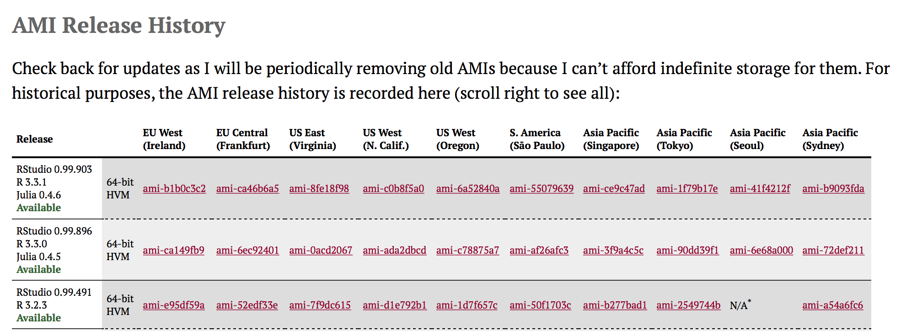

[Link for the US East (Virginia) region](https://console.aws.amazon.com/ec2/home?region=us-east-1#launchAmi=ami-8fe18f98)


---

#### STEP 2: Choose type of Machine

Once you click on a suitable AMI above, the browser should redirect you to an AWS page where you need to select the instance type. 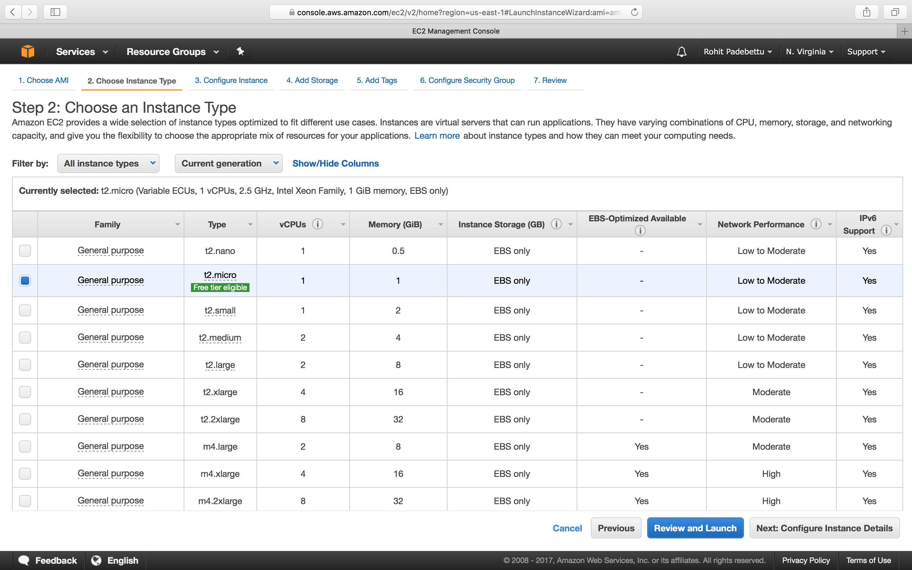


Select the General purpose t2.micro instance which is free tier eligible as shown.

Click `Next: Configure Instance Details`

---

#### STEP 3 : Configure Instance Details

On the Configure Instance Details page, review the default settings. The defaults are fine here. 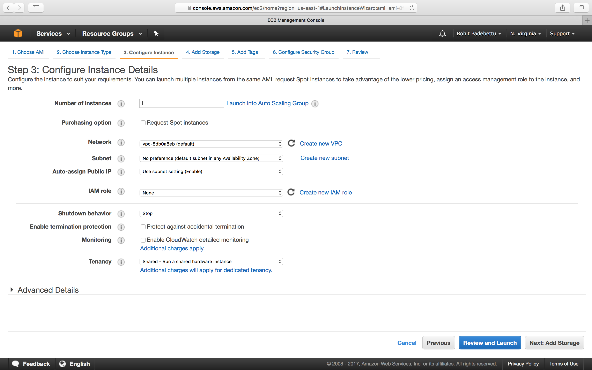


Click `Next: Add Storage`

---

#### STEP 4: Add Disk Storage

On the Add Storage page, you’ll be asked to specify the amount of storage you want. The defaults are fine here as well. The storage here has been optimized at 10GB to reduce the running costs of this machine even after the free tier period ends. 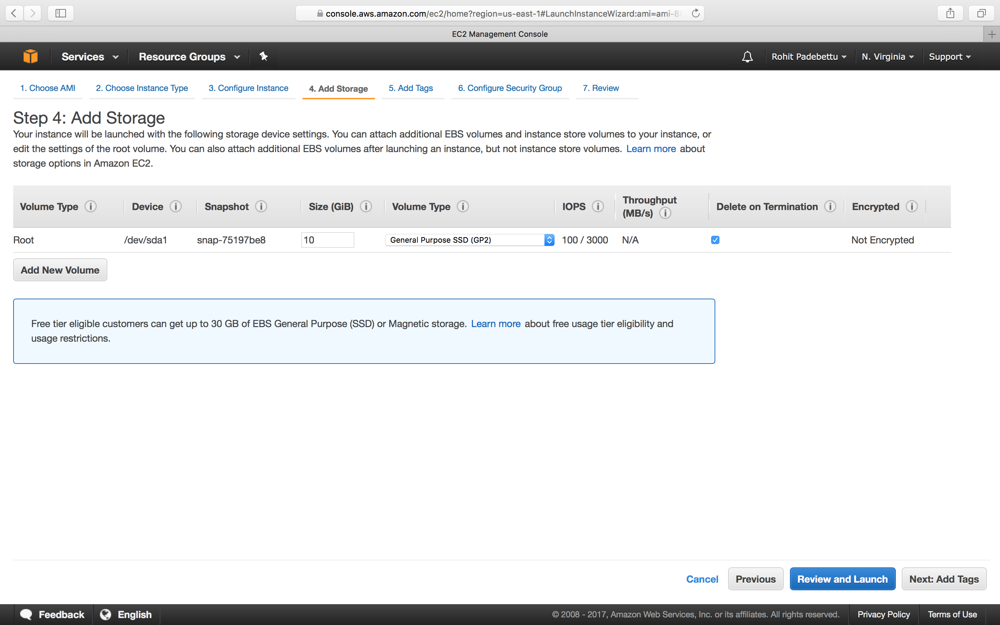


Click `Next: Add Tags`

---

#### STEP 5: Name your Machine

On this page you can give your instance a name (e.g. rstudio). 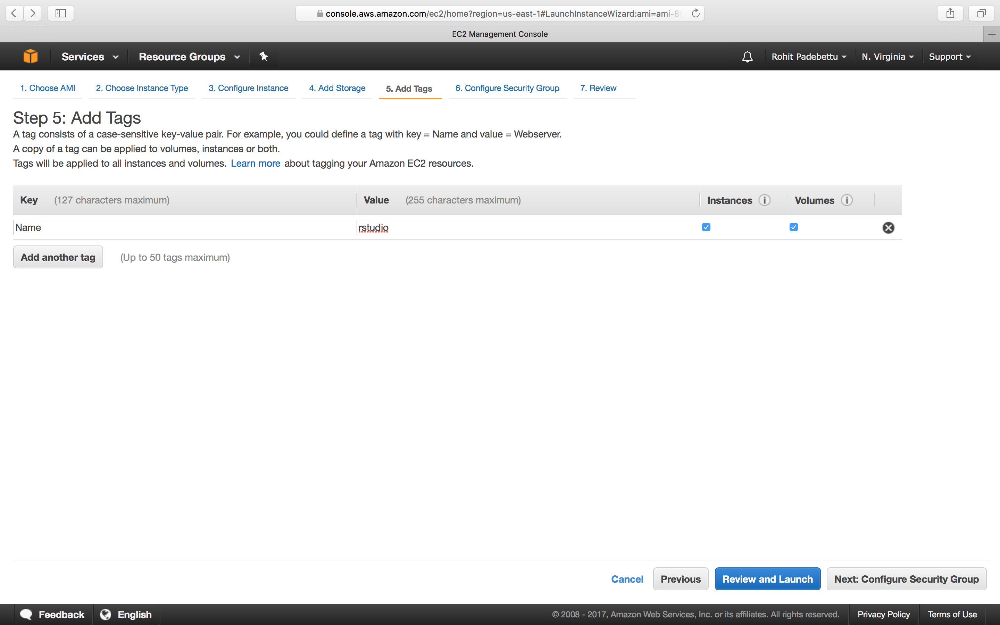


Click `Next: Configure Security Group`

---

#### STEP6: Make your Machine accessible

On this page you tell the AWS how you want your instance to interact with the outside world. 
- Select `Create a new security group` as shown below.
- Give your `Security Group` a name and description. This can be reused later across machine if you like
- SSH on port number 22 should already be enabled by default on this page. Just change the Source drop down from `Custom` to `Anywhere`. **SSH allows us to securely log into this cloud machine via a terminal if needed (we won't be doing so in this tutorial)**
- You can use the `Add Rule` button to add a new rule
- Select HTTP from the `Type` dropdown list this time
- Change the Source from `Custom` to `Anywhere` to allow access to this machine via the browser from any machine

The settings once done should look as shown below. 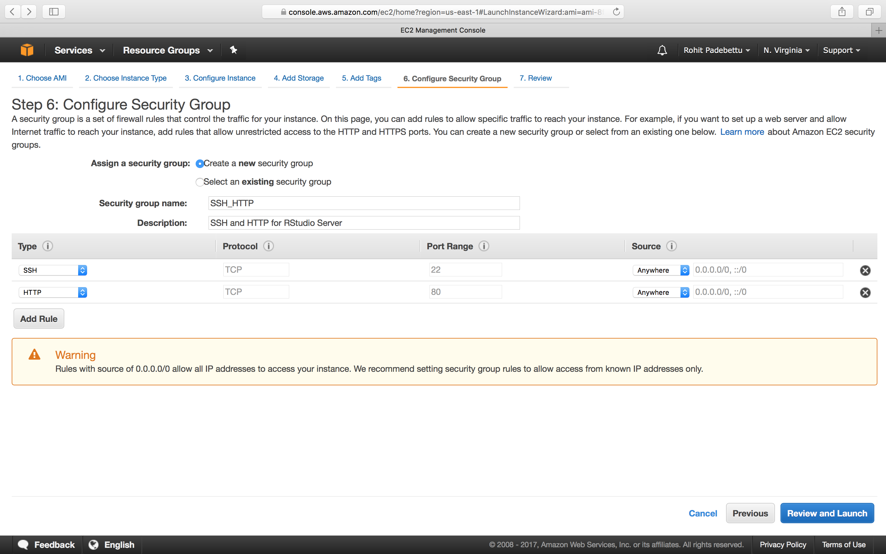


Click `Review and Launch`


---

#### STEP 7: Launch your Machine

If a warning is presented as shown below. Ignore it for now as the discussion of Network Security is beyond the scope of this tutorial. 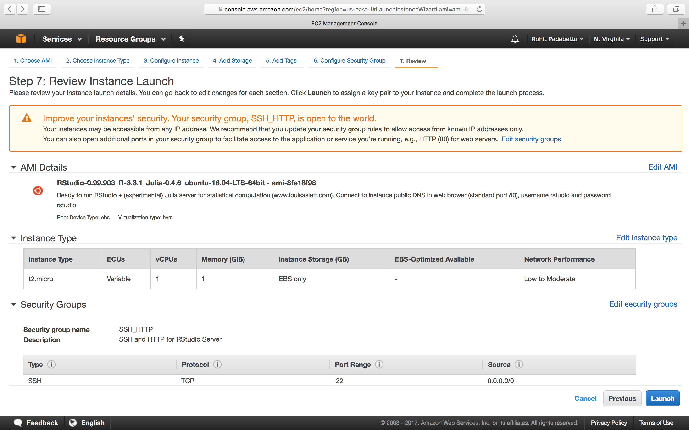


Click `Launch`
 
#### Download Key Pair 

You will now be presented with a pop-up window asking you to create a Key Pair. A Key Pair is a secure way of accessing the cloud machine. It is like an encrypted username/password combination which only you and AWS know about. Give your Key Pair a name you like and click the `Download Key Pair` button. You should store this file safely on your personal local machine in a safe place. You will not be able to download this file again (Although you can create a new Key Pair if required). This file is required to access the cloud machine through SSH and other means if required. 


This is it for configuration of your machine.
 
Click `Launch Instance` button once you have saved the key pair file
 
Once done you should be presented with the following page to indicate your instance is running. 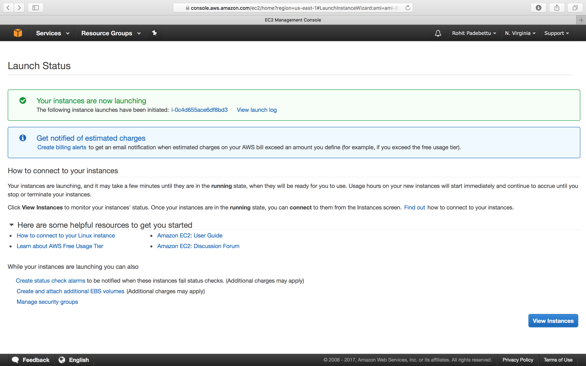

---

**Verify Instance State on Dashboard: **
The last step is to review the instance whether if it is running on your EC2 dashboard. If you named your instance `rstudio` as suggested in `STEP 5`, then you should see a row named `rstudio` running. Click on it to view your instance details and to get the public address of the machine to enable you to access RStudio Server remotely.

Copy the `Public DNS(IPv4)` in the bottom pane on the left side. This will vary for each one of you and each time you restart your cloud machine. For my account and instance, the address assigned this time is 
**ec2-34-201-250-34.compute-1.amazonaws.com**. 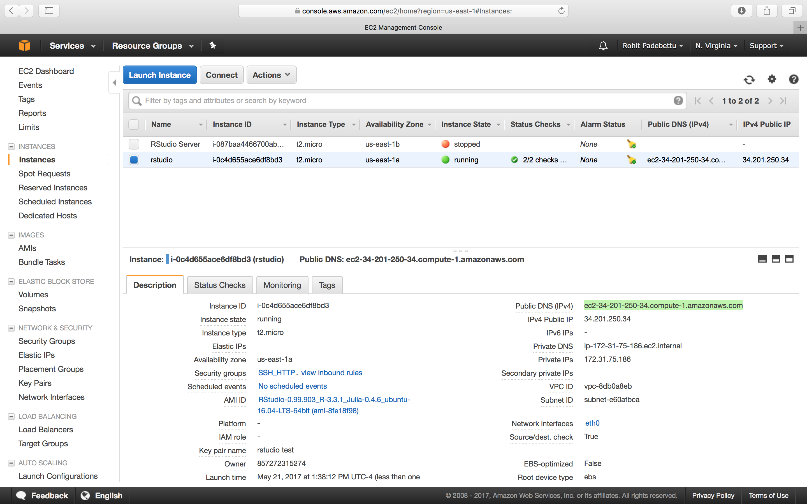


---

### Launch RStudio via web browser

Now you have configured a cloud computer for yourself and started it. If everything worked as expected, your cloud computer is now running and available for access via a web browser.

Launch a web browser of your choice on your local computer. Paste in the Public DNS you copied in the last step into the address bar and hit enter. If you have followed the steps until here, you should see a screen which looks like below. 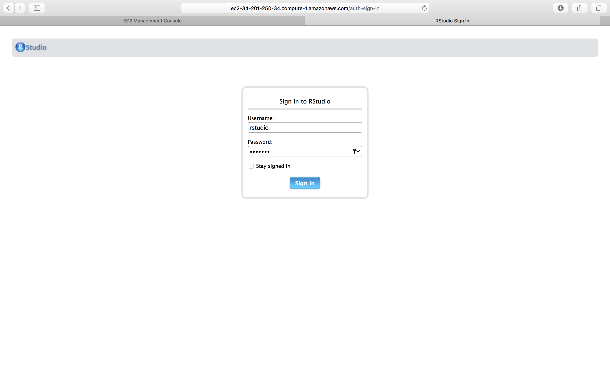


---

### Sign in to RStudio

```{r, eval=FALSE}
`Username`: `rstudio` and `Password`: `rstudio`
```


Presto! You should see RStudio running in your browser. It works exactly like RStudio installed on your local machine. You can go ahead and customize the look and feel, install your favorite package, create projects and work on solving your next Data Science problem, right from any browser. 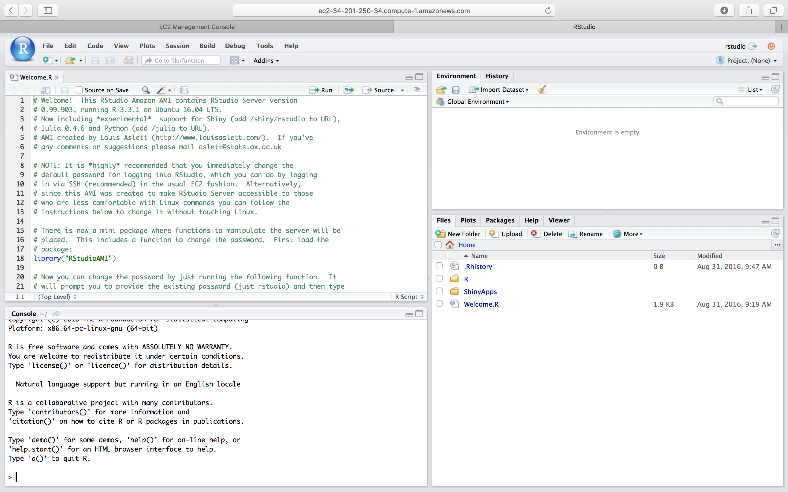


---

### Additional Configuration

The RStudio version running in your browser was configured to open a very helpful and important `Welcome.R` script.

Read through it and follow the instructions there to reset you password to something only you would remember. The following command should allow you to do so
```{r, eval=FALSE}
RStudioAMI::passwd()
```

**Note:** *If you don't do this, your machine is now accessible to anyone on the internet with a browser*

If interested, you could also use the instructions to link this machine to your `Dropbox` account, so that you have access to all the same files you have synced up to your Dropbox account. Dropbox is free for a limited storage space, so it is recommended you sign up for an account there and link it to this machine. You can use that folder to store the scripts and data files you produce while working in R. This allows you to retain your copy of the files even if you `terminate` or `delete` this cloud computer at some point later.

---

### Stop or Terminate the Instance

Right clicking on the instance in the AWS Console EC2 Dashboard, will give you options to Stop the Instance or Terminate the Instance. 

*Stopping the instance is like shutting down the computer, while terminating the instance is like returning the computer back to Amazon.*

**Note:** *To keep the data and latest configuration on this cloud computer, remember you only need to STOP the computer after use and there is no need to TERMINATE it, unless you decide to TERMINATE for cost or reasons. Under free tier currently, running only this continuously for a year, shouldn't cost you anything*

---

### Increased Computing Power

To increase the computing power available to you, all you need to do is go back to the AWS Console. Navigate to the EC2 dashboard. 

- Right click on the Stopped Instance and select Instance Settings -> Change Instance Type. 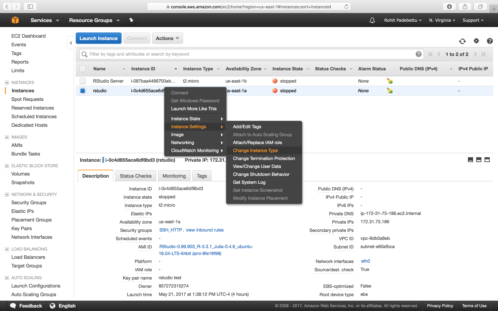


This should bring a pop-up window with a drop down menu that allows you to select the new instance type. 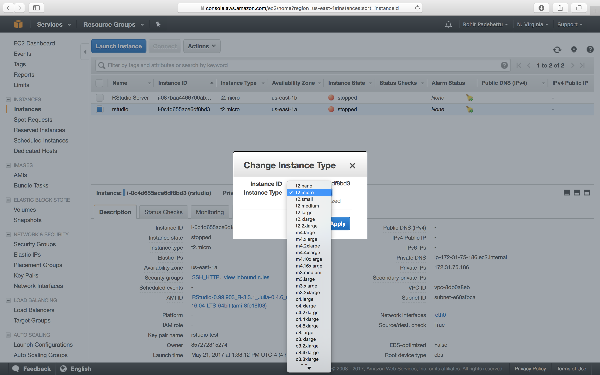


---

### AWS Instance Pricing

As of this writing, the pricing for various instance types on Amazon are as follows. For example you can rent a m4.4x large cloud computer with 4 CPU cores and 16GB of memory (similar to my Mac Pro Laptop) for only about $0.20 cents an hour.
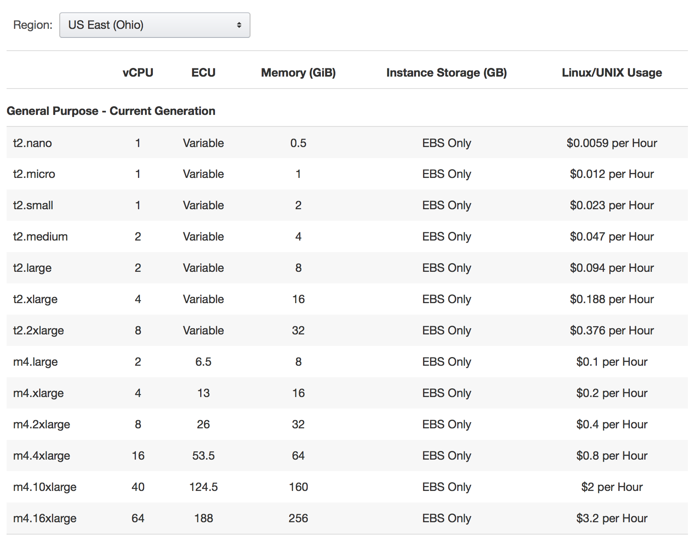


---

### Summary

*This tutorial was intended to get you started quickly on Amazon AWS. Demonstrate how tremendous cloud computing power is available to us virtually On Demand these days at our finger tips. The tutorial was also intended to help you get started with RStudio and other Data Science software in the cloud.*
